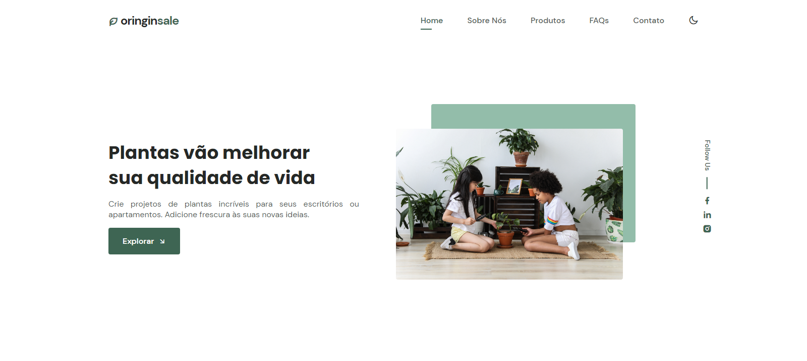
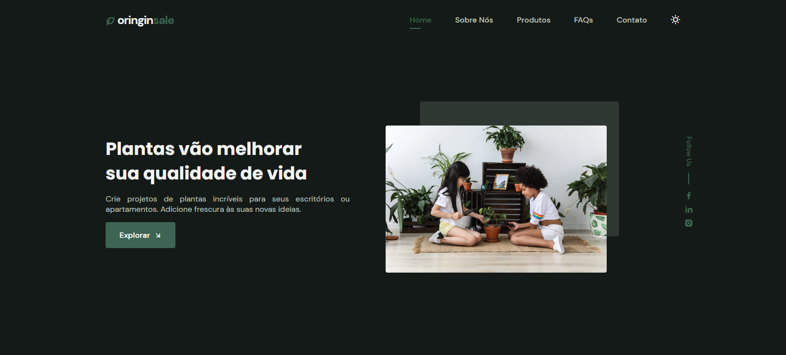

<h3 align="center"> 
	🎉 Plantas vão melhorar sua qualidade de vida!  🎉
</h3>

<br>

<div align="center">


[](https://www.linkedin.com/in/aiandralves/)

</div>

</p>

<a name="-project"></a>

## 💻 Projeto

<p align="justify">
    Originsale é uma loja online de plantas. Desenvolvido com um designer elegante e ao mesmo tempo simples. Originsale é a melhor opção para se adquirir plantinhas de qualidade com o melhor atendimento e suporte.
</p>

---

<a name="-layout"></a>

## 🎨 Layout

### Tema Claro

<div align="center">
    
</div>

### Tema Escuro

<div align="center">
    
</div>

---

<a name="-technologies"></a>

## ⛏ Tecnologias

Este projeto foi desenvolvido utilizando tecnologias de ponta de ponta.

-   [TypeScript](https://www.typescriptlang.org/)
-   [Angular](https://angular.io/)
-   [SASS](https://sass-lang.com/)

---

<a name="-installation"></a>

## 🚀 Instalação

```bash
# Clone o repositório
$ git clone https://github.com/aiandralves/originsale

# Entre na pasta do projeto
$ cd originsale

# Instale as dependências
$ npm install / yarn install

# Execute a aplicação
$ npm start / ng serve

# Abra http://localhost:4200 no seu navegador para ver a aplicação!

```

---

<a name="-contribution"></a>

## 🤝 Contribuição

Faça um **fork** do repositório e se te ajudei de alguma forma, deixe uma 🌟

---

<a name="-license"></a>

## 📝 License

Esse projeto está sob a licença do MIT. Veja o arquivo [LICENSE](LICENSE.md) para mais detalhes.

---

<a name="-autor"></a>

<p>
 <sub> Feito com ❤ por Aiandra Alves Meira 🌟</strong></sub>
</p>

[](https://www.linkedin.com/in/aiandralves/)
